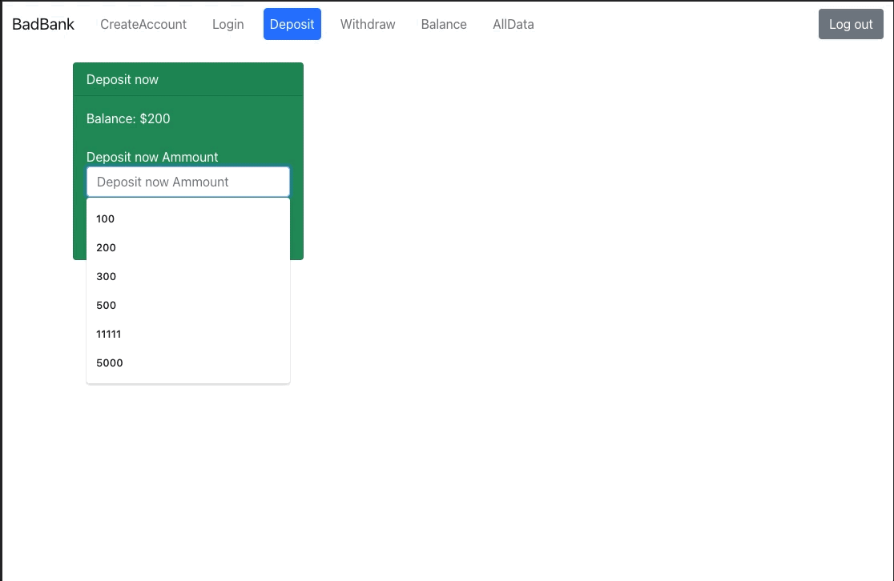
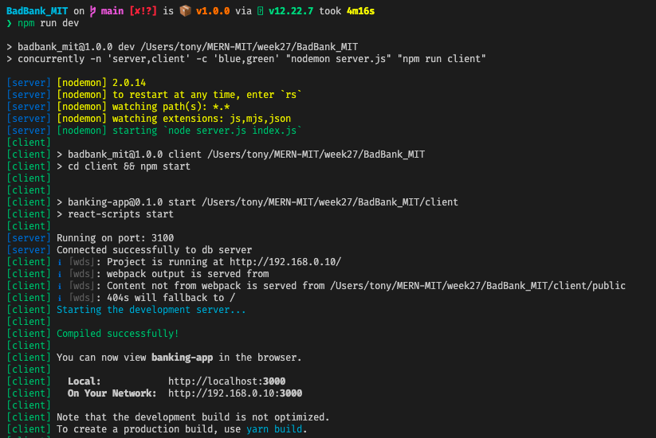

# Bad Bank Full Stack
## Description: 
The Bad Bank Full Stack application is a project developed by EffrenAnthony on MITxPro Full stack with MERN program, which simulates a bank environment were the user needs to log in, start a session with firebase and start doing operations in the bank such as deposit or withdraw money. The project is created in MERN stack, which means that the backend is built on NodeJS, Express and MongoDB, and the frontend is built with ReactJS (Create React App). Also, as part of the application for authentication, the project use firebase.

## Instalation:

1. Clone the project: Go to a directory on your computer and run this command.
```bash
git clone https://github.com/EffrenAnthony/BadBank_MIT
```
2. Install global dependencies: To run this project you will need to install `nodemon` and `concurrently` packages globaly. To do it you can run this commands.

```bash
npm i -g nodemon
```
```bash
npm i -g concurrently
```

3. Configurate Firebase: Create a project in firebase [https://console.firebase.google.com/](https://console.firebase.google.com/)
    - Client side: Go to your dashboard and copy the firebase configuration of your project into a new `.env` file in the `root of the client directory`. Only replace the values were correspond.
    - Server side: Go to your dashboard and copy the firebase and generate a private key JSON and copy into a new `firebaseConfig.json` file in the `root of the server directory`.

4. Run an instance of mongoDb with Docker: (Be sure you have docker installed on your local mashine) Run this command.

```bash
docker run -p 27017:27017 --name badbank -d mongo
```

5. Install project dependencies:

    - Client: move to `client` directory and run
    ```bash
    npm install
    ```
    - Server: move to `root` directory and run
    ```bash
    npm install
    ```

6. Run the project in development mode: Because of the use of `concurrently` you will be able to run the `client` and the `server` side with just one command and see all the logs in a sigle terminal. To do this, just simply run, in the `root`of the project, this command.

```bash
npm run dev
```

## Screenshots:



## Technology used:
- NodeJS
- express
- mongoDb
- ReactJS
- Firebase

## Features:

Features:
- Authentication and Register: Implemented on the frontend with firebase
- Deposit and withdraw amounts: Implemented on the backend and frontend to enable the user to do those actions.
- See balance: Implemented on frontend and backend to ask for the information of the user logged.
- List all users: Implemented on frontend and backend to list all the users information only if the user is logged.
- Permissions on actions: The user will only can do any action if it's logged

Features to include:

- Allow the user to have an historic of his/her transactions
- Allow the user to interact with other users to make transactions between them
- Deploy the app on a cloud server.

## License: 
MIT License

Copyright (c) [2021] [Effren Anthony Peña Sanchez]

Permission is hereby granted, free of charge, to any person obtaining a copy
of this software and associated documentation files (the "Software"), to deal
in the Software without restriction, including without limitation the rights
to use, copy, modify, merge, publish, distribute, sublicense, and/or sell
copies of the Software, and to permit persons to whom the Software is
furnished to do so, subject to the following conditions:

The above copyright notice and this permission notice shall be included in all
copies or substantial portions of the Software.

THE SOFTWARE IS PROVIDED "AS IS", WITHOUT WARRANTY OF ANY KIND, EXPRESS OR
IMPLIED, INCLUDING BUT NOT LIMITED TO THE WARRANTIES OF MERCHANTABILITY,
FITNESS FOR A PARTICULAR PURPOSE AND NONINFRINGEMENT. IN NO EVENT SHALL THE
AUTHORS OR COPYRIGHT HOLDERS BE LIABLE FOR ANY CLAIM, DAMAGES OR OTHER
LIABILITY, WHETHER IN AN ACTION OF CONTRACT, TORT OR OTHERWISE, ARISING FROM,
OUT OF OR IN CONNECTION WITH THE SOFTWARE OR THE USE OR OTHER DEALINGS IN THE
SOFTWARE.